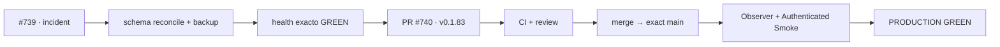

# BRVTAL — Último deploy

> Snapshot de **solo el deploy actual** para #739: recuperar GREEN completo después de reconciliar esquema y separar pérdida real de sesión de indisponibilidad transitoria de revalidación.

## Progress convention
- ✅ ~~Struck through~~ = completed and verified through required gates.
- 🚧 Normal text = pending/in progress.

## Estado del deploy
| Señal | Estado | Evidencia |
| --- | --- | --- |
| Work line | 🚧 **#739 · critical production recovery** | `work/issue-739` · reserva `35492d81-5395-4c98-b17d-df27d1caa80d` |
| Base | ✅ ~~**main**~~ | `606b5807cb80d179a6a2957f30d12ba491095b74` · v0.1.82 |
| Versión producto | 🚧 **v0.1.83** | patch deploy-bound |
| PR + snapshot exacto | 🚧 **#740** | auth semantics + smoke diagnostics |
| Producción actual | ✅ **health/schema recuperados** | v0.1.82 · exact SHA · DB connected · 15 applied / 0 pending |
| Producción candidato | 🚧 **pending** | CI → merge → exact-main observer + authenticated smoke |

## Huella del cambio
<!-- brvtal:git-delta -->
| Archivos | Inserciones | Eliminaciones | Neto |
| ---: | ---: | ---: | ---: |
| **0** | **+0** | **−0** | **0** |

## Calidad y entrega
<!-- brvtal:gate-plan -->
| Control | Estado / contrato |
| --- | --- |
| Gates | 🚧 **preflight · coordination · fast[PHP+JS] · database · chromium · real-stack · webkit** |
| Acceptance | 🚧 **AC-01 observer contract · AC-02 BRVTAL CI · AC-03 observer exact-main · AC-04 authenticated smoke · AC-05 safe diagnostics** |
| Factory | 🚧 Factory CI · Policy · Privacy · Labels |
| Review | 🚧 Sonar · CodeQL · CodeRabbit terminal |
| Exact-main | 🚧 BRVTAL CI · Production Deploy Observer · Authenticated Production Smoke |

## Qué se hizo
- Diagnosticó #739 hasta una causa inicial comprobada: health 503 por una migración aditiva pendiente, con DB y SHA exactos correctos.
- Ejecutó el reconcile canónico backup-first; producción quedó en 15 migraciones aplicadas, 0 pendientes y health 200.
- Conserva 401 `AUTH_REQUIRED` para sesión realmente ausente, expirada, desactivada o revocada por `credential_epoch`.
- Introduce estado interno `AUTH_REVALIDATION_UNAVAILABLE`: una excepción temporal al consultar DB sigue negando acceso, pero responde 503 y no destruye una sesión que no se demostró inválida.
- `GET /auth` conserva la misma semántica: 503 para revalidación no disponible, no `authenticated:false` engañoso.
- El smoke captura solo diagnóstico seguro: rutas 401 sin query strings, etapa/operación, auth counters, sección y visibilidad de modal; nunca cookies, CSRF, contraseñas, TOTP ni email.
- Añade regresión browser que exige que un 503 de auth permanezca fail-closed sin marcar `state.authed=false`, cerrar el modal ni disparar revalidación 401.
- Mantiene single-flight auth, mutaciones 401 no retriables, exact-SHA y schema readiness.

## Archivos modificados en este deploy
- `api/index.php` — `GET /auth` distingue indisponibilidad transitoria de pérdida real de sesión.
- `config/admin_auth.php` — boundary tri-state fail-closed; 503 no destructivo vs 401 revocado.
- `config/version.php` — v0.1.83.
- `package.json` — versión v0.1.83.
- `tests/admin-session-revalidation-contract.php` — contrato 401/503 y preservación fail-closed.
- `tests/e2e/discadmin-auth-cache.spec.mjs` — regresión browser de 503 no destructivo.
- `tests/e2e/production-authenticated-smoke.mjs` — atribución segura del primer 401/UI state.
- `tests/test_production_smoke_diagnostics.py` — AC-05 de privacidad/atribución.
- `README.md` — snapshot operativo exacto #739 / PR #740.

## Validación
- La reconciliación de migraciones usó el workflow owner-only, con backup `ready` antes de `ALLOW_WRITE=1`; no hubo SQL manual ni destructivo.
- Health post-reconcile: `ok=true`, DB connected, v0.1.82 y SHA `606b5807…` exactos, schema 15/15.
- Smoke exact-main v0.1.82 reprodujo dos fallos funcionales: Hero 401/revalidación fallida y modal Sets que no permaneció visible.
- El candidato v0.1.83 no aumenta retries ni convierte un fallo de infraestructura en autorización.
- Rollback: revert normal del patch v0.1.83; no contiene migraciones ni mutaciones de datos.

## Flujo de entrega

```mermaid
flowchart LR
  A["#739 · incident"] --> B["schema reconcile + backup"]
  B --> C["health exacto GREEN"]
  C --> D["PR #740 · v0.1.83"]
  D --> E["CI + review"]
  E --> F["merge → exact main"]
  F --> G["Observer + Authenticated Smoke"]
  G --> H["PRODUCTION GREEN"]
```

## Qué sigue
| Lane | Trabajo |
| --- | --- |
| **NOW** | 🚧 PR #740: cerrar CI/review sobre HEAD estable. |
| **NEXT** | 🚧 Merge serializado y validar exact-main BRVTAL CI + Production Deploy Observer + Authenticated Production Smoke. |
| **LATER** | 🚧 Con GREEN demostrado, registrar por separado el defecto Factory observado al sobrescribir metadata de un incidente automático reservado. |
| **BLOCKED / EXTERNAL** | 🚧 #737 sigue siendo decisión legal humana independiente y no se activa desde esta reparación. |

## Panorama general pendiente
- 🚧 **NOW**: #739 / PR #740, completar recuperación funcional de producción.
- 🚧 **NEXT**: exact-main GREEN con smoke autenticado completo.
- 🚧 **LATER**: reevaluar #630 y continuar roadmap cuando Tanda 1 quede cerrada.
- 🚧 **BLOCKED / EXTERNAL**: #737 permanece fuera del alcance técnico.
