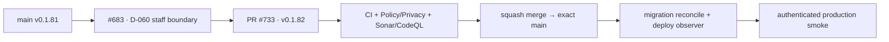

# BRVTAL — Último deploy

> Snapshot de **solo el deploy actual** para #683: v0.1.82 incorpora el boundary D-060 de staff/admin para ControlBot con autenticación HMAC, fail-closed y autoridad protegida.

## Progress convention
- ✅ ~~Struck through~~ = completed and verified through required gates.
- 🚧 Normal text = pending/in progress.

## Estado del deploy
| Señal | Estado | Evidencia |
| --- | --- | --- |
| Work line | 🚧 **#683 · ControlBot staff API D-060** | `work/issue-683` · reserva `8e52ea9b-4a5e-40f4-ad5b-36d88b6781d2` |
| Base | ✅ **main** | `01840c5dbba13f4ddda5c764a35dd818cc5e5243` · v0.1.81 |
| Producción base | ✅ **exacta** | observer `36366671718` · exact-main `01840c5d…` |
| Versión candidato | 🚧 **v0.1.82** | deploy-bound por endpoint + migración aditiva |
| PR + snapshot exacto | 🚧 **#733** | `work/issue-683` → `main` |
| Producción candidato | 🚧 **pending** | merge → migration reconcile → observer → smoke |

## Huella del cambio
<!-- brvtal:git-delta -->
| Archivos | Inserciones | Eliminaciones | Neto |
| ---: | ---: | ---: | ---: |
| **18** | **+1276** | **−69** | **+1207** |

## Calidad y entrega
<!-- brvtal:gate-plan -->
| Control | Estado / contrato |
| --- | --- |
| Gates | 🚧 **preflight · coordination · fast[PHP+JS] · database · chromium · real-stack · webkit** |
| Acceptance | 🚧 **AC-01 HMAC/staff-only · AC-02 audit/idempotency · AC-03 disabled=404/secret-free** |
| Factory | 🚧 Factory CI · Policy · Privacy · Labels |
| Review | 🚧 Sonar · CodeQL · CodeRabbit terminal |
| CI del SHA exacto de main | 🚧 exact-main BRVTAL CI · migration reconcile · Production Deploy Observer · Authenticated Production Smoke |

## Qué se hizo
- Añade `/ops/staff` y `/ops/summary` exclusivamente para staff/admin, sin exponer clientes ni usuarios públicos.
- Aplica HMAC-SHA256 D-060 con canonical query RFC3986, body raw hash, timestamp, nonce anti-replay, HTTPS, allowlist y rate limit.
- Las mutaciones usan `Idempotency-Key`, preservan resultados equivalentes y fallan 409 ante fingerprint divergente.
- `root/owner/superadmin/platform_owner` permanecen fuera de la autoridad mutante de ControlBot.
- Invite y password reset hacen handoff server-side y nunca devuelven tokens/credenciales.
- Añade `staff_role` mediante migración aditiva/idempotente; cuentas existentes quedan `superadmin` por defecto para fallar cerrado.
- `datos.yml` incorpora únicamente los tres tratamientos D-060 requeridos por Factory, aún en fase `construccion`.
- El set canónico de seis documentos de privacidad permanece derivado desde Factory v1; base, consentimiento y retención siguen en `review_required`.

## Archivos modificados en este deploy
- `README.md` — snapshot exacto de #683 / PR #733.
- `config/admin_password_security.php` — emisión de reset controlada para invitaciones fallidas e inactivas.
- `config/admin_staff_ops.php` — autenticación, canonicalización, replay/rate/idempotencia, autorización y auditoría.
- `config/migration_reconcile.php` — proof explícita de `staff_role` para reconciliación segura.
- `config/version.php` — v0.1.82.
- `database/migration_admin_staff_ops_01.sql` — metadata `staff_role` aditiva.
- `database/schema.sql` — schema base alineado.
- `datos.yml` — tratamientos mínimos de staff.
- `docs/privacidad/aviso-privacidad.md` — aviso regenerado desde el mapa de datos actual.
- `docs/privacidad/politica-tratamiento.md` — política regenerada desde el mapa de datos actual.
- `docs/privacidad/registro-tratamientos.md` — registro regenerado con los tratamientos D-060.
- `docs/privacidad/retencion.md` — tabla de retención regenerada sin inventar plazos legales.
- `ops/.htaccess` — routing/deny de worker sensible.
- `ops/index.php` — superficie HTTP staff/admin.
- `package.json` — versión v0.1.82.
- `tests/admin-staff-ops-contract.php` — regresiones D-060 deterministas.
- `tests/privacy-as-code-contract.php` — mapa/artefactos de privacidad alineados con D-060.
- `tests/test_admin_staff_api.py` — evidencia ejecutable AC-01..03.

## Validación
- Main base `01840c5d…` tenía BRVTAL CI success y Production Deploy Observer `36366671718` success.
- El contrato portable fuente es `pl0n3r/Factory/template/ops/admin-staff-api.json`; no se inventan headers, roles protegidos ni semántica de firma/idempotencia.
- El head candidato queda pendiente de sus gates; este snapshot no afirma deploy ni producción antes de observarlos.

## Flujo de entrega

```mermaid
flowchart LR
  A["main v0.1.81"] --> B["#683 · D-060 staff boundary"]
  B --> C["PR #733 · v0.1.82"]
  C --> D["CI + Policy/Privacy + Sonar/CodeQL"]
  D --> E["squash merge → exact main"]
  E --> F["migration reconcile + deploy observer"]
  F --> G["authenticated production smoke"]
```

## Qué sigue
| Lane | Trabajo |
| --- | --- |
| **NOW** | 🚧 PR #733: cerrar acceptance + CI + seguridad/review sobre un head estable. |
| **NEXT** | 🚧 Merge serializado y exact-main CI. |
| **LATER** | 🚧 Migración/observer/smoke de v0.1.82 sin secretos reales en pruebas. |
| **BLOCKED / EXTERNAL** | 🚧 [#734](https://github.com/pl0n3r/brvtal/issues/734) bloquea go-live/procesamiento real de staff hasta decisión legal; claves/allowlist siguen fuera del repositorio. |

## Panorama general pendiente
- 🚧 **NOW**: #683 / PR #733, validar el boundary D-060.
- 🚧 **NEXT**: exact-main + producción v0.1.82.
- 🚧 **LATER**: al liberar BRVTAL, reintentar el crítico #689 (Factory v1 production observer).
