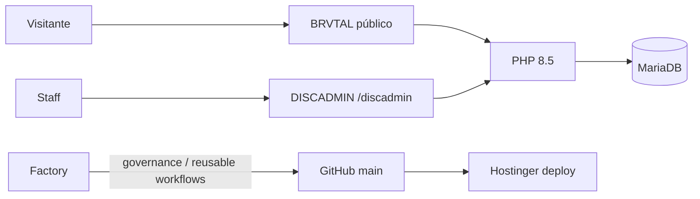

# BRVTAL

> Plataforma underground de música y archivo cultural con una experiencia pública editorial y un DISCADMIN unificado.

**Rol en la fábrica:** product · **Fase:** live · **Roadmap:** [Issue #533](https://github.com/pl0n3r/brvtal/issues/533)

BRVTAL sirve el producto público y su administración editorial desde el mismo repositorio. El README es la portada operativa bajo **README Contract v1**: resume estado, arquitectura y fuentes canónicas sin convertirse en changelog ni en segundo roadmap.

## Operational Cockpit

<!-- factory:status:start -->
| Señal | Estado |
| --- | --- |
| main SHA | UNKNOWN |
| versión | UNKNOWN |
| CI | UNKNOWN |
| release | UNKNOWN |
| health | UNKNOWN |
| smoke/observer | UNKNOWN |
| quality/security | UNKNOWN |
| Issue activo | UNKNOWN |
| PR activo | UNKNOWN |
| último release | UNKNOWN |
<!-- factory:status:end -->

### Progress + Readiness

<!-- factory:progress-readiness:start -->
| Señal | Estado |
| --- | --- |
| Target | UNKNOWN |
| Progress | UNKNOWN |
| Readiness | UNKNOWN |
| Evidence freshness | UNKNOWN |
| Critical blockers | UNKNOWN |
| Trend | UNKNOWN |

| Dimensión | Progress | Readiness |
| --- | --- | --- |
| UNKNOWN | UNKNOWN | UNKNOWN |
<!-- factory:progress-readiness:end -->

> Los bloques anteriores son derivados. `UNKNOWN` / `PENDING` significa que falta evidencia canónica suficiente; nunca se sustituye por `GREEN` o `DEGRADED` sin evidencia verificable.

## Work Queue

- **NOW:** [#746 — adoptar README Contract v1](https://github.com/pl0n3r/brvtal/issues/746).
- **NEXT:** [#623 — reducir serialización y overhead de DISCADMIN](https://github.com/pl0n3r/brvtal/issues/623).
- **LATER:** continuar el [roadmap #533](https://github.com/pl0n3r/brvtal/issues/533) por prioridad y dependencias.
- **BLOCKED:** los bloqueos vigentes se mantienen en #533 y en sus Issues específicos; este README no los infiere ni los duplica.

Esta vista resume la cola. El orden, progreso e historial de entregas viven en GitHub Issues y Releases.

## Qué hace el producto

BRVTAL combina dos superficies principales:

- **Producto público:** archivo cultural underground de artistas, eventos, blog, media, relaciones editoriales, SEO y contenido conectado.
- **DISCADMIN:** shell administrativo único para edición, configuración, media, operaciones y observabilidad editorial.

Las capacidades permanentes y decisiones de producto se documentan en `docs/BRVTAL-SPEC.md`; los cambios efímeros pertenecen al PR y a GitHub Releases.

## Arquitectura en 60 segundos


```mermaid
flowchart LR
    V[Visitante] --> P[BRVTAL público]
    S[Staff] --> A[DISCADMIN /discadmin]
    P --> H[PHP 8.5]
    A --> H
    H --> D[(MariaDB)]
    G[GitHub main] --> X[Hostinger deploy]
    F[Factory] -->|governance / reusable workflows| G
```

DISCADMIN conserva **ONE SHELL / ONE SIDEBAR / ONE SESSION / ONE CENTRAL WORKSPACE**. El producto público y la administración comparten runtime y datos, pero mantienen identidades visuales y responsabilidades distintas.

## Stack e infraestructura

- **Backend:** PHP 8.5.
- **Frontend:** HTML, CSS y JavaScript vanilla.
- **Base de datos:** MariaDB / MySQL-compatible.
- **Hosting:** Hostinger shared hosting / LiteSpeed.
- **Testing:** contratos PHP/Python, integración, Playwright Chromium y WebKit dirigido.
- **CI:** BRVTAL CI + reusable workflows de Factory.
- **Entrega:** GitHub `main` → Hostinger Git auto-deploy.
- **Observabilidad:** deploy observer, authenticated production smoke, performance y quality/security gates.

## Ciclo de entrega

Issue → `/take` → `work/issue-N` → PR → BRVTAL CI / README Contract / revisiones → merge serial → CI del SHA exacto de `main` → observación de deploy → smoke/validación de producción cuando aplique.

Un merge, release o deploy observado no sustituye la validación de comportamiento en producción.

## Calidad y seguridad

- `BRVTAL CI / validate` es el gate estable de código.
- README Contract valida metadata y bloques derivados sin inventar salud.
- SonarCloud y CodeRabbit aportan análisis sobre el HEAD estable del PR.
- Admin/API protegidos requieren autenticación y CSRF según corresponda.
- SQL usa validación server-side, prepared statements y migraciones data-safe.
- Backups, restore y rollback deben preservar datos y fallar cerrado.
- No se versionan secretos, tokens, contraseñas, PII ni contenido productivo de la base.
- Health, smoke, release y readiness solo se representan como terminales cuando existe evidencia canónica.

## Roadmap y fuentes de verdad

- Ejecución y progreso: [Issue #533](https://github.com/pl0n3r/brvtal/issues/533).
- Contrato operativo de agentes: `AGENTS.md`.
- Producto y arquitectura: `docs/BRVTAL-SPEC.md`.
- Testing y evidencia: `docs/TESTING.md`.
- Decisiones vigentes: `decisiones.yml`.
- Privacidad/datos: `datos.yml`.
- Cambios entregados: GitHub PRs y Releases.
- Gobernanza transversal: [Factory PLAN-AGENTES.md](https://github.com/pl0n3r/factory/blob/main/PLAN-AGENTES.md).

El README enlaza estas fuentes; no las replica.

## Desarrollo local

Comandos reproducibles principales:

```bash
composer install
npm ci
npm run test:contracts
npm run test:coordination
```

Para cobertura completa usa los comandos documentados en `docs/TESTING.md` y los workflows de CI. Los E2E no usan credenciales ni datos productivos.

## Mapa de la fábrica

- **Factory:** governance/kit y workflows comunes.
- **ControlBot:** control plane; repositorio público, panel de acceso restringido.
- **FactoryRunner:** execution plane autónomo.
- **Condor / GrindFlow / BRVTAL:** productos.
- **AutoFactory:** herramienta local/manual del dueño.

**BRVTAL** es el producto actual de este repositorio; su operación no transfiere responsabilidades de control plane ni execution plane a otros componentes.
