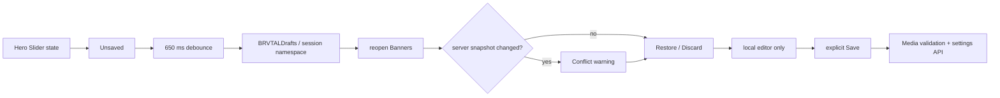

# BRVTAL — Último deploy

> Snapshot de **solo el deploy actual** para #713: recovery local del Hero Slider/Banners sobre su state model propio y `BRVTALDrafts`. No declara producción GREEN.

## Progress convention
- ✅ ~~Struck through~~ = completed and verified through required gates.
- 🚧 Normal text = pending/in progress.
- 🚧 = active production blocker.

## Estado del deploy
| Señal | Estado | Evidencia |
| --- | --- | --- |
| Work line | 🚧 **#713 · Hero Slider recoverable drafts** | `work/issue-713` · reserva `c9542f71-1811-40e0-9f60-3ba875268d2d` |
| Base | ✅ **main** | `6f1fa6e85d2a88a1627af253ba7645cf4e0fa790` |
| Versión | 🚧 **v0.1.70** | `config/version.php` + `package.json` |
| PR | 🚧 **delivery de #713** | exact-head gates obligatorios antes de merge |
| Producción | 🚧 **NO GREEN · #681** | migration registry parity sigue bloqueado externamente |
| Continuidad | ✅ **separada** | #714 Theme Studio · #715 SEO E2E flake |

## Huella del cambio
<!-- brvtal:git-delta -->
| Archivos | Inserciones | Eliminaciones | Neto |
| ---: | ---: | ---: | ---: |
| **6** | **+514** | **−78** | **+436** |

## Calidad y entrega
<!-- brvtal:gate-plan -->
| Control | Estado / contrato |
| --- | --- |
| Gates | 🚧 **preflight · coordination · fast[PHP+JS] · database · chromium · real-stack · webkit** |
| Factory | 🚧 Policy · Privacy · Labels |
| Snapshot | 🚧 PR + snapshot exacto |
| Main | 🚧 CI del SHA exacto de main tras merge |
| Review | 🚧 Sonar + CodeRabbit |
| Seguridad | localStorage same-origin por sesión; sin endpoint, proveedor, permiso ni migración nuevos |
| Producción | #681 permanece fuera de alcance; no se declara GREEN |

## Flujo de entrega

```mermaid
flowchart LR
  H["Hero Slider state"] --> U["Unsaved"]
  U --> D["650 ms debounce"]
  D --> L["BRVTALDrafts / session namespace"]
  L --> R["reopen Banners"]
  R --> C{"server snapshot changed?"}
  C -- no --> X["Restore / Discard"]
  C -- yes --> W["Conflict warning"]
  W --> X
  X --> F["local editor only"]
  F --> S["explicit Save"]
  S --> M["Media validation + settings API"]
```

## Qué se hizo
- Hero Slider reutiliza `BRVTALDrafts` directamente; no fuerza el adapter legacy.
- Autosave local persiste la configuración normalizada con debounce y **no hace POST/PUT**.
- El recovery ofrece Restore / Discard y deriva una revisión estable serializando canónicamente el snapshot server-side crudo, antes de cualquier normalización que genere IDs.
- Restore modifica solo el editor; no publica ni evita la validación de Media.
- `save()` sigue siendo la única autoridad de Media validation + escritura en `/settings`.
- Un Save exitoso limpia recovery solo si el editor sigue igual al payload enviado.
- Ediciones hechas mientras el Save está en vuelo quedan `Unsaved` sin arrancar un debounce paralelo; eventos `input/change` duplicados son idempotentes y al resolver el Save se persisten una sola vez sobre la nueva revisión server.
- Fallos de Save conservan recovery cuando storage está disponible.
- Expiración de sesión purga drafts mediante el boundary compartido.
- Guards de navegación y `beforeunload` siguen activos.
- Sin SQL, migración, Hostinger write ni cambios de readiness.

## Archivos modificados en este deploy
- `README.md`
- `config/version.php`
- `discadmin/hero-slider-v2.css`
- `discadmin/hero-slider.js`
- `package.json`
- `tests/e2e/hero-slider-v2.spec.mjs`

## Validación
- Sintaxis JS del runtime y E2E validada antes de PR.
- E2E nuevo: autosave local sin mutación server + Restore explícito.
- E2E nuevo: conflicto cuando cambia el snapshot server.
- E2E nuevo: failed Save conserva input + draft local.
- E2E nuevo: Save race conserva ediciones posteriores con una barrera explícita de solicitud, sin sleeps arbitrarios.
- E2E nuevo: session boundary elimina recovery.
- Harness admin corre bajo origen HTTP same-origin para probar localStorage de forma realista.
- No cambia `datos.yml`: sin nuevo dato personal, proveedor ni transferencia.
- 🚧 La evidencia de CI/Sonar/CodeRabbit se registra solo después de ejecutar los gates del HEAD exacto.

## Qué sigue
| Lane | Trabajo |
| --- | --- |
| **NOW** | 🚧 [#713](https://github.com/pl0n3r/brvtal/issues/713): cerrar exact-head gates y merge. |
| **NEXT** | 🚧 [#714](https://github.com/pl0n3r/brvtal/issues/714): recovery de Theme Studio sin activar el tema implícitamente. |
| **CI DEBT** | 🚧 [#715](https://github.com/pl0n3r/brvtal/issues/715): SEO failed-save E2E. |
| **LATER** | 🚧 [#533](https://github.com/pl0n3r/brvtal/issues/533): roadmap canónico. |
| **BLOCKED / EXTERNAL** | 🚧 [#681](https://github.com/pl0n3r/brvtal/issues/681): migration registry parity / producción NO GREEN. |
| **BLOCKED BY #681** | 🚧 #530: Recycle Bin requiere metadata durable/migración segura. |

## Panorama general pendiente
- 🚧 **NOW**: #713 / v0.1.70.
- 🚧 **NEXT**: #714.
- 🚧 **CI DEBT**: #715.
- 🚧 **BLOCKED / EXTERNAL**: #681 permanece fail-closed; no se ejecuta reconcile sin backup/autoridad verificable.
