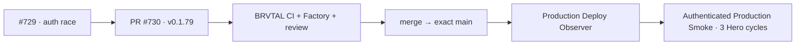

# BRVTAL — Último deploy

> Snapshot de **solo el deploy actual** para #729: eliminar la carrera autenticada Dashboard → Hero Slider observada por production smoke.

## Progress convention
- ✅ ~~Struck through~~ = completed and verified through required gates.
- 🚧 Normal text = pending/in progress.

## Estado del deploy
| Señal | Estado | Evidencia |
| --- | --- | --- |
| Work line | 🚧 **#729 · Hero auth race** | `work/issue-729` · reserva `8641deaa-e514-4047-8a17-384000a6b4a3` |
| Base | ✅ **main** | `0b01f86b8fc429f95d30859b2081ac79fe177403` · v0.1.78 |
| Versión | 🚧 **v0.1.79** | patch deploy-bound |
| PR | 🚧 **#730 en revisión** | `work/issue-729` → `main` |
| Main | 🚧 **pending** | exact-main tras merge |
| Producción | 🚧 **pending** | observer + authenticated smoke exactos |

## Huella del cambio
<!-- brvtal:git-delta -->
| Archivos | Inserciones | Eliminaciones | Neto |
| ---: | ---: | ---: | ---: |
| **12** | **+258** | **−69** | **+189** |

## Calidad y entrega
<!-- brvtal:gate-plan -->
| Control | Estado / contrato |
| --- | --- |
| Gates | 🚧 **preflight · coordination · fast[PHP+JS] · database · chromium · real-stack · webkit** |
| Snapshot | 🚧 **PR + snapshot exacto** · Factory CI · Policy · Privacy · Labels |
| Acceptance | 🚧 AC-01..04 Python contract · AC-05 BRVTAL CI · AC-06 Deploy Observer · AC-07 Authenticated Smoke |
| Review | 🚧 Sonar · CodeQL · CodeRabbit |
| Main | 🚧 **CI del SHA exacto de main** · exact version/SHA/schema + 3 ciclos Dashboard ↔ Hero |

## Flujo de entrega

```mermaid
flowchart LR
  A["#729 · auth race"] --> B["PR #730 · v0.1.79"]
  B --> C["BRVTAL CI + Factory + review"]
  C --> D["merge → exact main"]
  D --> E["Production Deploy Observer"]
  E --> F["Authenticated Production Smoke · 3 Hero cycles"]
```

## Qué se hizo
- `admin-auth-boundary.js`: `force:true` omite el snapshot, pero comparte cualquier `/auth` ya en vuelo.
- Diagnóstico seguro separa revalidaciones intentadas, exitosas y fallidas sin secretos ni PII.
- Dashboard V2 expone una promesa real de mount y comparte el mount activo.
- `go('dashboard')` espera el mount protegido antes de permitir la siguiente navegación.
- Hero conserva retry solo para transporte/5xx; auth/rate-limit/aplicación continúan fail-closed.
- Mutaciones 401 siguen sin revalidación ni retry.
- Contratos legacy de Dashboard ahora fijan explícitamente el mount esperado, sin reactivar el preload `/dashboard`.

## Archivos modificados en este deploy
- `README.md` — snapshot operativo, evidencia, huella y alcance exacto del deploy.
- `config/version.php` — versión deploy-bound v0.1.79.
- `discadmin/admin-auth-boundary.js` — revalidación single-flight y expiración de sesión que invalida mounts pendientes.
- `discadmin/dashboard-v2.js` — promesa compartida de mount, invalidación por sesión y limpieza protegida por serial.
- `discadmin/hero-slider.js` — diagnóstico seguro de revalidación y política fail-closed de lectura protegida.
- `discadmin/index-core.php` — navegación espera Dashboard V2 e invalida mounts en login/logout.
- `package.json` — scripts de regresión del candidato.
- `tests/admin-performance-contract.php` — contrato legacy alineado con la carga actual del Dashboard.
- `tests/dashboard-v2-contract.php` — contrato del mount Dashboard V2.
- `tests/e2e/discadmin-auth-cache.spec.mjs` — regresiones de revalidación concurrente y mutaciones 401.
- `tests/e2e/discadmin-dashboard-v2-authority.spec.mjs` — regresiones ejecutables de mount pendiente, ownership e invalidación entre sesiones.
- `tests/test_hero_auth_race.py` — contrato Factory AC-01..04 y presencia de las regresiones críticas.

## Validación
- Dos GET protegidos con 401 en paralelo comparten una sola llamada `/auth`.
- Dashboard V2 no resuelve `mount()` hasta terminar sus fuentes protegidas.
- `tests/test_hero_auth_race.py` fija AC-01..04 para Factory v1.
- #125 conserva tres ciclos reales Dashboard ↔ Hero; no se incrementan retries.
- Sin migraciones, cambios de esquema ni mutaciones de datos por este deploy.
- Rollback: revert normal de v0.1.79 a v0.1.78.

## Qué sigue
| Lane | Trabajo |
| --- | --- |
| **NOW** | 🚧 [#729](https://github.com/pl0n3r/brvtal/issues/729) · PR #730: cerrar gates sobre HEAD exacto y fusionar. |
| **NEXT** | 🚧 Exact-main BRVTAL CI + Production Deploy Observer. |
| **LATER** | 🚧 Authenticated Production Smoke fresco con los 3 ciclos Hero Slider. |
| **BLOCKED / EXTERNAL** | 🚧 Ningún blocker externo conocido para este slice; no se declara completado hasta AC-07. |

## Panorama general pendiente
- 🚧 **NOW**: #729 / PR #730, cerrar la carrera de sesión Dashboard → Hero.
- 🚧 **NEXT**: demostrar v0.1.79 desplegado con SHA/version/schema exactos.
- 🚧 **LATER**: continuar #533 cuando la reparación de salud quede cerrada.
