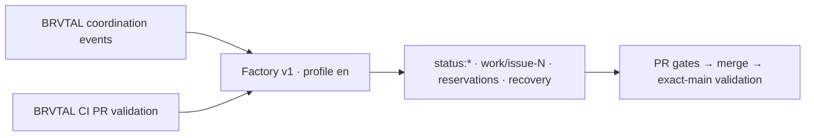

# BRVTAL — Último deploy

> Snapshot de **solo el deploy actual** para #692: adoptar Factory v1 como autoridad única de coordinación BRVTAL con paridad fail-closed.

## Progress convention
- ✅ ~~Struck through~~ = completed and verified through required gates.
- 🚧 Normal text = pending/in progress.

## Estado del deploy
| Señal | Estado | Evidencia |
| --- | --- | --- |
| Work line | 🚧 **#692 · Factory v1 coordination parity** | `work/issue-692` · reserva `f3f8870f-19b2-49a6-93d2-243aa7a114cd` |
| Base | ✅ **main** | `f49173254ae1eae5b332b2074aee7f48a97b3825` · v0.1.78 source |
| Versión | ✅ **v0.1.78** | mantenimiento de repositorio; sin cambio de runtime |
| PR | 🚧 **#728 en revisión** | `work/issue-692` → `main` |
| Main | 🚧 **pending** | CI del SHA exacto de main tras merge |
| Producción | 🚧 **sin cambio por este PR** | no toca runtime, DB, Hostinger ni datos |

## Huella del cambio
<!-- brvtal:git-delta -->
| Archivos | Inserciones | Eliminaciones | Neto |
| ---: | ---: | ---: | ---: |
| **10** | **+331** | **−3184** | **−2853** |

## Calidad y entrega
<!-- brvtal:gate-plan -->
| Control | Estado / contrato |
| --- | --- |
| Gates | 🚧 **preflight · coordination · coordination-pr · fast[PHP+JS] · database · chromium · real-stack · webkit · recovery** |
| Factory | 🚧 Policy · Privacy · Labels |
| Snapshot | 🚧 PR + snapshot exacto |
| Main | 🚧 CI del SHA exacto de main tras merge |
| Review | 🚧 Sonar + CodeRabbit |
| Producción | ✅ ~~No deployment required by this repository-only change.~~ |

## Flujo de entrega

```mermaid
flowchart LR
  E["BRVTAL coordination events"] --> F["Factory v1 · profile en"]
  C["BRVTAL CI PR validation"] --> F
  F --> R["status:* · work/issue-N · reservations · recovery"]
  R --> G["PR gates → merge → exact-main validation"]
```

## Qué se hizo
- `Factory@v1` pasa a ser la autoridad única para comment, label, PR, Issue, validate y sweep con `profile: en`.
- BRVTAL CI valida reserva, rama canónica y colisiones mediante el reusable publicado, no mediante código local.
- Los callers conceden el envelope requerido por `workflow_call`; Factory restringe permisos efectivos dentro de cada operación.
- Se elimina `scripts/work_coordinator.py` y su suite legacy para evitar doble autoridad.
- El contrato nuevo bloquea `pull_request_target`, exige comandos EN y conserva serialización y recuperación stale.
- PR #728 usa una excepción bootstrap autoacotada para su marker legacy v1; todos los PR posteriores exigen fingerprint Factory.

## Archivos modificados en este deploy
- `.github/workflows/update-release-metadata.yml` — validación PR delegada a Factory v1 y gate de contrato local.
- `.github/workflows/work-coordination.yml` — callers comment/label/pr/issue/sweep con perfil EN.
- `README.md` — snapshot operativo exacto de #692.
- `docs/factory-adoption.json` — coordinación movida a `consumed`; #681 retirado y #689 conservado como blocker real.
- `scripts/work_coordinator.py` — eliminado; autoridad trasladada a Factory v1.
- `tests/test_factory_coordination_adoption.py` — regresiones de paridad, permisos y autoridad única.
- `tests/ci-scope-contract.php` — contrato actualizado para agregar `coordination-pr` al gate canónico.
- `tests/factory-adoption-contract.php` — estado ejecutable de adopción actualizado a Factory v1 coordination.
- `tests/project-operations-contract.php` — contrato operacional migrado desde autoridad local a evidencia Factory v1.
- `tests/test_work_coordinator.py` — eliminado junto con la implementación local.

## Validación
- No cambia producto, versión runtime, DB, migraciones, Hostinger ni producción.
- La fuente ejecutada por coordinación privilegiada es Factory v1, no código no confiable del PR.
- `/take`, `/recover`, `/release`, `/transfer` y `/force-release` siguen en el perfil EN publicado.
- `sweep` horario conserva la recuperación de reservas inactivas sin liberar autoridad silenciosamente.
- BRVTAL CI ejecuta casos de comportamiento directamente desde el `Factory@v1` publicado para lock, stale recovery, UUID/owner, validación y colisiones.
- El cierre exige BRVTAL CI, Factory Policy, Privacy, Sonar y CodeRabbit verdes sobre el HEAD exacto.

## Qué sigue
| Lane | Trabajo |
| --- | --- |
| **NOW** | 🚧 [#692](https://github.com/pl0n3r/brvtal/issues/692): validar y fusionar adopción Factory v1. |
| **NEXT** | 🚧 Verificar BRVTAL CI sobre el SHA exacto de `main` tras merge. |
| **LATER** | 🚧 [#630](https://github.com/pl0n3r/brvtal/issues/630): continuar cierre de Tanda 2 del kit. |
| **BLOCKED / EXTERNAL** | 🚧 #689 sigue siendo el blocker externo restante del épico #630; no bloquea este slice de coordinación. |

## Panorama general pendiente
- 🚧 **NOW**: #692, retirar definitivamente la autoridad local de coordinación.
- 🚧 **NEXT**: exact-main verde y evidencia en el épico #630.
- 🚧 **LATER**: #533 roadmap de producto cuando Tanda 2 lo permita.
