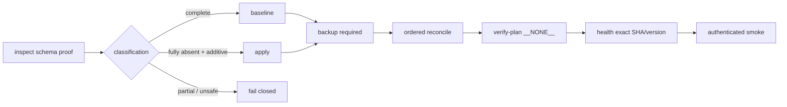

# BRVTAL — Último deploy

> Snapshot de **solo el deploy actual** para #681: recuperación fail-closed del migration registry y aplicación controlada de migraciones aditivas realmente ausentes.

## Progress convention
- ✅ ~~Struck through~~ = completed and verified through required gates.
- 🚧 Normal text = pending/in progress.
- 🚧 = active production blocker.

## Estado del deploy
| Señal | Estado | Evidencia |
| --- | --- | --- |
| Work line | 🚧 **#681 · production migration registry parity** | `work/issue-681` · reserva `6ba1abcd-5c7a-4b59-8a25-3a6c4efcdfa8` |
| Base | ✅ **main** | `59d1b9355077c958ddbc5f9e49915bf82d09ffb2` |
| Versión | 🚧 **v0.1.72** | patch deploy-bound |
| PR | 🚧 **delivery de #681** | PR + snapshot exacto |
| Main | 🚧 **post-merge** | CI del SHA exacto de main |
| Producción | 🚧 **NO GREEN** | reconcile → health → authenticated smoke pendientes |

## Huella del cambio
<!-- brvtal:git-delta -->
| Archivos | Inserciones | Eliminaciones | Neto |
| ---: | ---: | ---: | ---: |
| **11** | **+352** | **−70** | **+282** |

## Calidad y entrega
<!-- brvtal:gate-plan -->
| Control | Estado / contrato |
| --- | --- |
| Gates | 🚧 **preflight · coordination · fast[PHP+JS] · database · chromium · real-stack · webkit · recovery** |
| Factory | 🚧 Policy · Privacy · Labels |
| Snapshot | 🚧 PR + snapshot exacto |
| Main | 🚧 CI del SHA exacto de main tras merge |
| Review | 🚧 Sonar + CodeRabbit |
| Producción | 🚧 backup → reconcile → verify-plan → health → authenticated smoke |

## Flujo de entrega

```mermaid
flowchart LR
  I["inspect schema proof"] --> C{"classification"}
  C -->|complete| B["baseline"]
  C -->|fully absent + additive| A["apply"]
  C -->|partial / unsafe| X["fail closed"]
  B --> K["backup required"]
  A --> K
  K --> R["ordered reconcile"]
  R --> V["verify-plan __NONE__"]
  V --> H["health exact SHA/version"]
  H --> S["authenticated smoke"]
```

## Qué se hizo
- El proof estructural distingue esquema completo, totalmente ausente y parcial/ambiguo.
- Solo el esquema completo puede baselinearse.
- Un esquema totalmente ausente solo puede aplicarse si el SQL pasa el guard automático aditivo.
- El guard permite cláusulas DDL legítimas `ON DELETE` / `ON UPDATE` y eventos `BEFORE/AFTER INSERT`, pero rechaza DML `INSERT`, `REPLACE`, `LOAD DATA`, `DELETE`, `UPDATE`, además de `DROP` y otras operaciones no aditivas.
- Las acciones `baseline` / `apply` conservan el orden canónico de migraciones.
- Un estado parcial o SQL inseguro queda `blocked` antes del backup y de cualquier write.
- El reconcile vuelve a validar el plan, exige backup, ejecuta SQL aditivo, prueba el schema y solo entonces registra la migración antes de aceptar `verify-plan __NONE__`.
- El transporte solo expone metadata estructural acotada; no filas de aplicación ni secretos.
- Health permanece fail-closed; no se cambia el contrato de readiness.

## Archivos modificados en este deploy
- `.github/workflows/production-migration-reconcile.yml` — muestra baseline/apply/blocked y corta antes de writes si hay ambigüedad.
- `README.md` — snapshot operativo V0.1.72.
- `config/migration_reconcile.php` — clasificación y ejecución ordenada baseline/apply/blocked.
- `config/migrations.php` — guard aditivo más preciso y sin DML automático.
- `config/version.php` — versión V0.1.72.
- `ops/factory/transport.py` — valida el nuevo contrato del plan y revalida blocked antes del backup.
- `package.json` — sincroniza la versión de runtime con V0.1.72.
- `scripts/migrations.php` — evidencia separada de baseline y apply.
- `tests/factory-hostinger-transport-contract.php` — regresión backup/write fail-closed.
- `tests/migrations-contract.php` — clasificación, SQL aditivo y estados ambiguos.
- `tests/test_production_migration_reconcile_workflow.py` — contrato del workflow de recuperación.

## Validación
- El planner debe clasificar `migration_admin_password_security_01.sql` como apply solo cuando todos sus requisitos estén ausentes.
- Estados parciales deben abortar antes de cualquier write.
- SQL con DML/destrucción debe permanecer bloqueado.
- MariaDB, real-stack y recovery rehearsal deben pasar.
- Sonar exact-head debe permanecer sin issues/hotspots nuevos.
- CodeRabbit no debe dejar findings accionables.
- Work Coordination y Factory gates deben pasar.
- Tras merge, producción debe probar backup registrado, `verify-plan __NONE__`, health 200 exacto y authenticated smoke PASS.

## Qué sigue
| Lane | Trabajo |
| --- | --- |
| **NOW** | 🚧 [#681](https://github.com/pl0n3r/brvtal/issues/681): integrar V0.1.72 y ejecutar reconcile canónico. |
| **NEXT** | 🚧 Revalidar producción exact-main y cerrar el incidente solo con health + authenticated smoke PASS. |
| **LATER** | 🚧 [#533](https://github.com/pl0n3r/brvtal/issues/533): retomar roadmap canónico cuando producción vuelva a GREEN. |
| **BLOCKED / EXTERNAL** | ✅ ~~[#719](https://github.com/pl0n3r/brvtal/issues/719): credenciales de transporte provisionadas y verificadas.~~ |

## Panorama general pendiente
- 🚧 **NOW**: #681, restaurar migration registry parity con backup-before-write.
- 🚧 **NEXT**: declarar GREEN únicamente con exact SHA/version/schema + smoke autenticado.
- 🚧 **LATER**: #533 roadmap canónico.
- ✅ ~~**BLOCKED / EXTERNAL**: #719 resuelto; GitHub Actions ya autentica por SSH.~~
