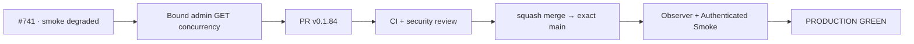

# BRVTAL — Último deploy

> Snapshot de **solo el deploy actual** para [#741](https://github.com/pl0n3r/brvtal/issues/741): reducir la presión concurrente de lecturas administrativas autenticadas sin relajar auth ni aumentar retries.

## Progress convention
- ✅ ~~Struck through~~ = completed and verified through required gates.
- 🚧 Normal text = pending/in progress.

## Estado del deploy
| Señal | Estado | Evidencia |
| --- | --- | --- |
| Work line | 🚧 **#741 · critical production recovery** | `work/issue-741` · reserva `51c236a0-5c96-41b9-b88e-3699df99e338` |
| Base | ✅ ~~**main**~~ | `e452d067f188eae69bf281de7c4a4083f3626ace` · v0.1.83 |
| Versión producto | 🚧 **v0.1.84** | patch deploy-bound |
| PR + snapshot exacto | 🚧 **candidate** | bounded admin GET pressure + regressions |
| Producción actual | 🚧 **health/observer GREEN · authenticated smoke RED** | v0.1.83 · exact SHA · DB connected · schema 15/15 |
| Producción candidato | 🚧 **pending** | CI → merge → exact-main observer + authenticated smoke |

## Huella del cambio
<!-- brvtal:git-delta -->
| Archivos | Inserciones | Eliminaciones | Neto |
| ---: | ---: | ---: | ---: |
| **6** | **+278** | **−49** | **+229** |

## Calidad y entrega
<!-- brvtal:gate-plan -->
| Control | Estado / contrato |
| --- | --- |
| Gates | 🚧 **preflight · coordination · fast[PHP+JS] · database · chromium · real-stack · webkit** |
| Acceptance | 🚧 **AC-01 bounded GETs · AC-02 auth/mutation escape · AC-03 no retry inflation · AC-04 CI · AC-05 observer · AC-06 smoke** |
| Factory | 🚧 Factory CI · Policy · Privacy · Labels |
| Review | 🚧 Sonar · CodeQL · CodeRabbit terminal |
| CI del SHA exacto de main | 🚧 BRVTAL CI · Production Deploy Observer · Authenticated Production Smoke |

## Qué se hizo
- Aisló dos smokes fallidos sobre v0.1.83: no hubo 401 ni pérdida de sesión; hubo múltiples `AUTH_REVALIDATION_UNAVAILABLE` / HTTP 503 en GET administrativos.
- Confirmó que Sets y su modal son byte a byte iguales al último baseline GREEN v0.1.81; el segundo smoke pasó Sets completo y falló después en Hero por 503.
- Añade una cola FIFO de máximo **2 GET administrativos simultáneos** en el boundary global.
- `/auth` permanece fuera de la cola para que la revalidación nunca dependa de un slot saturado.
- POST/PUT/PATCH/DELETE permanecen fuera de la cola y sin retry.
- El único retry GET tras 401 conserva single-flight auth y vuelve a pasar por el mismo límite de lectura.
- Expone solo contadores seguros de presión (`active/queued/limit`), sin URLs, payloads, cookies, CSRF ni PII.

## Archivos modificados en este deploy
- `README.md` — snapshot operativo exacto de #741.
- `config/version.php` — v0.1.84.
- `discadmin/admin-auth-boundary.js` — backpressure FIFO para GET admin, escape seguro de auth/mutaciones.
- `package.json` — versión v0.1.84.
- `tests/e2e/discadmin-auth-cache.spec.mjs` — regresiones de techo de concurrencia, no-deadlock y fail-closed.
- `tests/test_admin_read_pressure.py` — contrato ejecutable AC-01..03.

## Validación
- Evidencia productiva origen: v0.1.83 exacta, health 200, DB connected y schema 15/15.
- Smoke intento 1: sesión válida y Sets API 200; modal no abrió tras fallo de hidratación auxiliar.
- Smoke intento 2: Sets completo PASS; Hero 1 PASS; Hero 2 falla con `AUTH_REVALIDATION_UNAVAILABLE` 503; dashboard registra 503 concurrentes en varias superficies.
- El patch no agrega retries, no cambia PHP/auth server-side, no toca esquema/datos y no amplía permisos.
- Rollback: revert del patch v0.1.84; cero mutaciones de datos.

## Flujo de entrega

```mermaid
flowchart LR
  A["#741 · smoke degraded"] --> B["Bound admin GET concurrency"]
  B --> C["PR v0.1.84"]
  C --> D["CI + security review"]
  D --> E["squash merge → exact main"]
  E --> F["Observer + Authenticated Smoke"]
  F --> G["PRODUCTION GREEN"]
```

## Qué sigue
| Lane | Trabajo |
| --- | --- |
| **NOW** | 🚧 [#741](https://github.com/pl0n3r/brvtal/issues/741): validar candidato v0.1.84. |
| **NEXT** | 🚧 Merge serializado y exact-main BRVTAL CI + Production Deploy Observer + Authenticated Production Smoke. |
| **LATER** | 🚧 Reanudar roadmap normal solo después de GREEN completo. |
| **BLOCKED / EXTERNAL** | 🚧 [#737](https://github.com/pl0n3r/brvtal/issues/737) sigue siendo una decisión legal independiente. |

## Panorama general pendiente
- 🚧 **NOW**: #741, recuperar authenticated production smoke sin retries adicionales.
- 🚧 **NEXT**: demostrar exact-main GREEN.
- 🚧 **LATER**: volver a #630/roadmap cuando Tanda 1 quede cerrada.
- 🚧 **BLOCKED / EXTERNAL**: #737 permanece fuera del alcance técnico.
